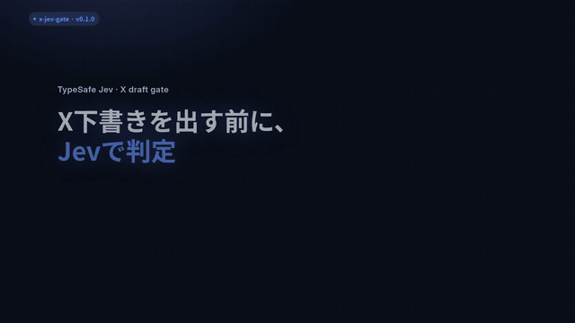
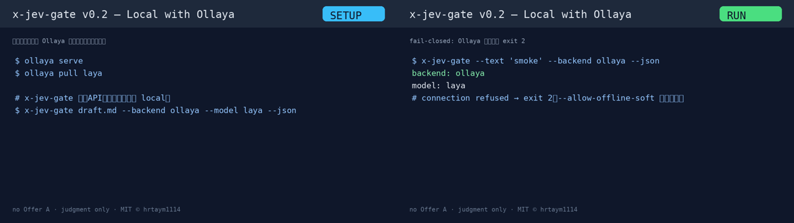

# x-jev-gate

**TypeSafe Jev（System One）に「出してよいか」を確率で聞ける、X下書き用の判定CLI。**

A small public gate for X drafts: Layer A hard-blocks secret-looking strings locally, then Layer B asks [TypeSafe Jev](https://docs.typesafe.ai) defined Noul questions and exits non-zero when scores miss thresholds.

- Jev **writes nothing, posts nothing, publishes nothing** — judgment only.
- No long LLM critique. Cheap, fast, explainable Noul scores.
- Sibling of [`grok-bot-jev`](https://github.com/Bodila51/grok-bot-jev) (Grok Bot router). This package is **post-gate specialized**.

## 使い方（動画）

約54秒の解説（日本語 UI / コマンドはそのまま英語）。

GitHub のリポジトリ内プレビューは大きな MP4 を再生できないことがあるので、**ページ上では GIF**、本編は **Release の MP4** を使う。



**[▶ 本編 MP4（1080p・無音）を開く](https://github.com/hrtaym1114-github/x-jev-gate/releases/download/v0.1.0/x-jev-gate-howto.mp4)**  
ストーリーボード: [strip](docs/media/x-jev-gate-howto-strip.png) · [Release v0.1.0](https://github.com/hrtaym1114-github/x-jev-gate/releases/tag/v0.1.0)

### 4ステップ

1. **Install** — `pip install git+https://github.com/hrtaym1114-github/x-jev-gate.git`
2. **判定先を選ぶ**
   - **Cloud（既定）** — `export TYPESAFE_API_KEY=...`（shell / secret manager のみ。コミット禁止）
   - **Local（Ollaya）** — [ollaya.dev](https://ollaya.dev/) で `ollaya serve` + `ollaya pull laya`（キー不要・既定 `local`）。詳細は [Local with Ollaya](#local-with-ollaya)
3. **Run** — `x-jev-gate --text '...'` または `--backend ollaya`
4. **結果** — **PASS**（exit 0）/ **BLOCK**（exit 1）/ 判定不可（exit **2**・fail closed）

キー無しのスモーク: `x-jev-gate --dry-run-offline --text 'smoke test body'`  
※ 自動投稿はしません。判定のみです。Offer A / 販売リンクはありません。

## What is Jev?

Jev（TypeSafe System One）は、定義済みの yes/no（Noul）質問に対して確率スコアを返す安い判断層です。生成モデルに長文批評させる代わりに、「ペルソナに刺さるか」「フックがあるか」「公開してよいか」などを数値で返し、しきい値で gate します。

## Install

```bash
# from GitHub (recommended for users)
pip install git+https://github.com/hrtaym1114-github/x-jev-gate.git

# editable (recommended while developing)
pip install -e ".[dev]"
# or with uv
uv pip install -e ".[dev]"
```

Requires Python ≥ 3.10 and a TypeSafe API key for cloud judgment.

```bash
export TYPESAFE_API_KEY=...   # secret manager / shell env only
# このツールは vault の秘密ファイルを読みません
```

Never commit the key. The CLI never logs `TYPESAFE_API_KEY`.

## Local with Ollaya

閉域ノートやキー無しの現場向けに、[Ollaya](https://ollaya.dev/)（非提携）上のローカル System One へ繋げます。  
x-jev-gate は Ollaya を**同梱・自動起動しません**。別プロセスで立ててから `--backend ollaya` します。

[](docs/media/x-jev-gate-ollaya-howto.gif)

- 🎞️ [GIF](docs/media/x-jev-gate-ollaya-howto.gif) · Release: [v0.2.0](https://github.com/hrtaym1114-github/x-jev-gate/releases/tag/v0.2.0)

### オペ手順（最短）

```bash
# 端末 A
ollaya serve
ollaya pull laya

# 端末 B（この CLI）
x-jev-gate draft.md --backend ollaya --model laya --json
# または環境変数:
# export X_JEV_GATE_BACKEND=ollaya
# export TYPESAFE_DEFAULT_MODEL=laya
```

既定の接続先は `http://127.0.0.1:11435`。キー未設定時は `local`。  
TypeSafe SDK 経由で Ollaya 互換の `/v1/systemone` を叩きます。

| Environment variable | Meaning / 意味 |
|----------------------|----------------|
| `X_JEV_GATE_BACKEND` | `typesafe`（既定）または `ollaya`。`--backend` が優先 |
| `TYPESAFE_BASE_URL` | Base URL 上書き（`OLLAYA_HOST` より優先） |
| `OLLAYA_HOST` | ホストまたは URL。ホストだけなら `http://` 付与。既定 `http://127.0.0.1:11435` |
| `TYPESAFE_API_KEY` | ローカルでは任意（未設定→`local`）。クラウドでは必須 |
| `TYPESAFE_DEFAULT_MODEL` | モデル名。`--model` が優先。Ollaya 既定は `laya` |

**注意（オペ向け）**
- オープンモデル ≠ TypeSafe クラウドの Jev 品質。しきい値の再調整が必要なことがあります。
- Ollaya 停止・接続拒否は **exit 2**（fail closed）。`--allow-offline-soft` で警告＋exit 0 にできます（非推奨）。
- JSON / 人間向け要約に `backend` と `model` が出ます。クラウドでモデル未指定のとき JSON の `model` は `null` です。

## Usage

```bash
# file
x-jev-gate examples/pass.txt --profile manufacturing-it

# inline text
x-jev-gate --text "16GBノートで測った結果…" --json

# stdin
cat draft.txt | x-jev-gate --stdin --strict

# vault markdown (## 投稿文 fenced block)
x-jev-gate path/to/draft.md --format vault-md

# local Ollaya (server must already be running)
x-jev-gate --text "16GBノートで測った結果…" --backend ollaya --model laya --json

# CI smoke without network
x-jev-gate --dry-run-offline --text "smoke test body"

# measurement period: always exit 0, still print scores
x-jev-gate draft.txt --shadow --json
```

### Profiles

| Profile | Reader |
|---------|--------|
| `manufacturing-it` (default) | 製造業IT・16GB閉域ノートの固定ペルソナ（ops `PRIMARY_READER` を移植） |
| `generic-tech` | もう少し広い hands-on 技術者 |

Override thresholds with `--threshold-file thresholds.yaml`.

### Noul questions (v0.1)

| ID | Default threshold |
|----|-------------------|
| `persona_attraction` | 0.65 |
| `hook_strength` | 0.65 |
| `memorability` | 0.65 |
| `reader_value` | 0.65 |
| `evidence_quality` | 0.60 |
| `message_clarity` | 0.60 |
| `source_connection` | 0.60 |
| `safe_to_publish` | 0.70 |

`safe_to_publish` は勤務先リーク・他者攻撃・機密っぽさを意味で見る Jev 質問です。正規表現側（Layer A）は鍵・パス漏洩など機械的なものだけに縮小しています。

## Exit codes

| Code | Meaning |
|------|---------|
| `0` | pass（または `--shadow`） |
| `1` | Layer A hard block、または Jev しきい値割れ |
| `2` | Jev 利用不可（クラウド: キー無し・API障害 / ローカル: Ollaya 停止など）。**既定は fail closed** |

`--allow-offline-soft` を付けると、利用不可時に警告のみで exit 0 にできます（非推奨）。

## Architecture

```
入力（下書き）
  ├─ Layer A  Hard fail-closed（ローカル）
  │     APIキー様 / password= / /Users/ パス
  │     → hit なら即 exit 1（Jev を呼ばない）
  ├─ Layer B  Jev System One（--backend typesafe|ollaya）
  │     複数 Noul → しきい値比較
  └─ Layer C  人間可读要約 + --json
```

## Relation to grok-bot-jev

| | grok-bot-jev | x-jev-gate |
|--|--------------|------------|
| Role | Grok Bot 作業ルーター | X下書きゲート |
| Actions | reuse_cache / stop_retry / … | pass / block |
| Shared | TypeSafe `system_one` + env key only | same |

## Non-goals

- 長文の添削生成（それは LLM）
- 自動投稿・X への書き込み
- grok-bot-jev ルーター全体の再発明

## License

MIT © hrtaym1114
